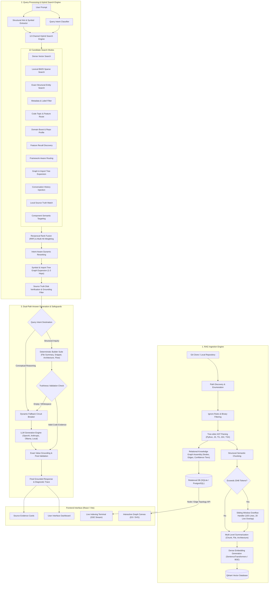

# CodeSeek

CodeSeek is a repository-grounded code assistant. It clones a GitHub repository, parses and chunks supported files, stores embeddings and metadata in Qdrant, and answers questions using retrieved source evidence.

## Components

- `backend/rag_ingestion/`: discovery, filtering, parsing, chunking, metadata, summaries, embeddings, Qdrant storage, and graph construction.
- `backend/retrieval/`: FastAPI API, sessions, retrieval, generation, memory, persistence, authentication, and diagnostics.
- `frontend/`: React and Vite interface for repositories, indexing, chat, source evidence, providers, and repository graphs.
- `tests/e2e/`: Playwright deployment workflow tests.

## End-to-End System Architecture & Workflow Diagram



---


## Local Start

Requirements: Docker with Compose.

```bash
cp backend/.env.example backend/.env
docker compose -f docker-compose.dev.yml up --build
```

The development stack exposes:

- Frontend: `http://localhost:5173`
- Backend: `http://localhost:8000`
- Backend health: `http://localhost:8000/api/v1/health`
- Qdrant: `http://localhost:6333`
- PostgreSQL: `localhost:5432`

Configure GitHub OAuth, provider credentials, and embedding settings before indexing private repositories or generating answers.

## Verification

```bash
PYTHONPATH=backend backend/.venv/bin/python -m pytest backend/tests
npm --prefix frontend test
npm --prefix tests/e2e test
```

## Documentation

Start with [the documentation index](docs/README.md). It links the product, architecture, pipeline, API, operations, testing, and reference pages.

## Current Boundaries

- Tree-sitter parsers are configured for Python, JavaScript, TypeScript, JSX, and TSX.
- Qdrant stores repository chunks; SQLite or PostgreSQL stores application state.
- Retrieval combines deterministic lookup, dense search, optional lexical search, metadata search, expansion, reranking, and source filtering.
- Graph retrieval is configurable as shadow diagnostics, per-query Graph Assist, or process-level active mode.
- Provider keys and GitHub credentials are encrypted before database storage when the application encryption key is configured.
