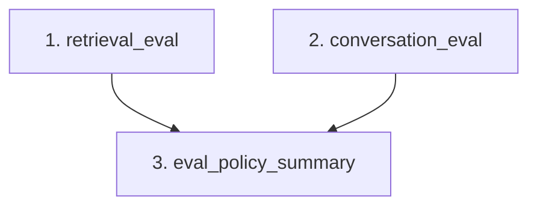

# Safe Evaluation Runner / CI Workflow

The Safe Evaluation Runner (`evals/run_safe_evals.py`) orchestrates the execution of CodeSeek's evaluation pipeline in a safe, serial sequence. It runs the core deterministic retrieval and conversation checks and produces a single unified summary report containing the gating status, return codes, and logs for all steps.

---

## 1. Quick Start

Run the default safe workflow (retrieval + conversation evaluations + policy gating):

```bash
.venv/bin/python evals/run_safe_evals.py \
  --session-id d0080c2f183740699918777d953f25fa \
  --expected-repo-root /home/arch/DEV/CodeSeek \
  --expected-collection repository_chunks__local__codeseek \
  --output-dir evals/reports/safe_eval_latest
```

### Generated Files

The command generates the following files in the specified `--output-dir`:

* **`retrieval_latest.json`**: Output from deterministic retrieval evaluation.
* **`conversation_latest.json`**: Output from multi-turn conversation context evaluation.
* **`eval_policy_summary.json` / `.md`**: Gating verification reports.
* **`safe_eval_summary.json` / `.md`**: Unified summary reports including step durations, exit codes, and stdout/stderr tails.

---

## 2. Command Line Arguments

### Required Arguments

* **`--session-id`**: The database session UUID.
* **`--expected-repo-root`**: Absolute path to the expected repository root.
* **`--expected-collection`**: The Qdrant collection name.
* **`--output-dir`**: Output directory for generated reports.

### Optional Flags

* **`--db-backend`**: Override the database backend (defaults to `sqlite` or `CODESEEK_DB_BACKEND` env).
* **`--db-path`**: Override the SQLite database file path (defaults to `/tmp/codeseek.sqlite3` or `CODESEEK_DB_PATH` env).
* **`--python-bin`**: The Python binary used to launch subprocesses (defaults to the active interpreter).
* **`--timeout`**: Timeout in seconds per subprocess (default: `1800` seconds).
* **`--verbose`**: Print full commands and detailed progress messages.

---

## 3. Workflow Steps & Dependencies

The runner maps and runs steps sequentially. It manages step dependencies, skipping downstream runs if required dependencies fail:



* **Required steps** (retrieval_eval, conversation_eval) must succeed (exit code 0) for the policy verification step (`eval_policy_summary`) to execute.
* If a step is skipped due to upstream failure, its return code is reported as `-1` with a skipped status description.

---

## 4. Overall Status Determination

The unified `status` field in `safe_eval_summary.json` is computed as follows:

* **`ERROR`**:
  * Any required step (e.g. `retrieval_eval`, `conversation_eval`) exits non-zero or times out.
  * The policy summary status is `ERROR`.
* **`WARN`**:
  * All required steps exit zero, but the policy summary status is `WARN`.
* **`PASS`**:
  * All required steps exit zero, and the policy summary status is `PASS`.
