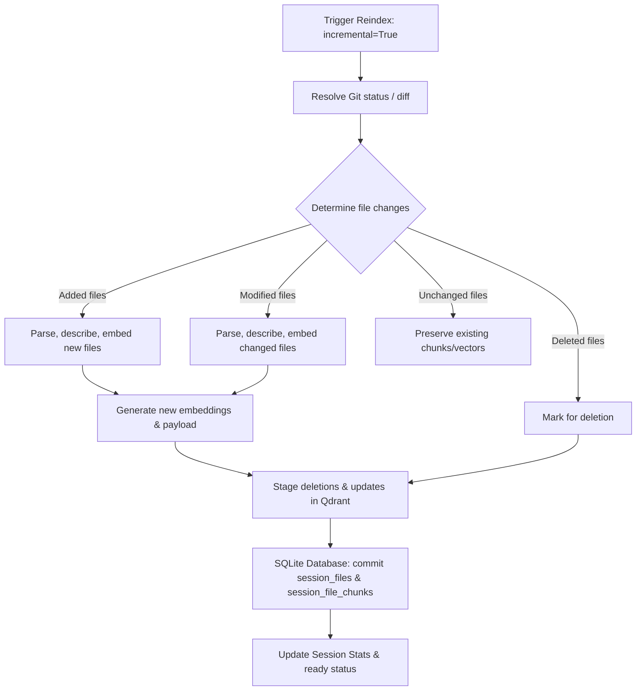

# Incremental File-Diff Reindexing V1 Implementation Design

This document details the architecture, data models, safety protocols, and implementation plan for **Incremental File-Diff Reindexing V1** in CodeSeek.

---

## 1. Architectural Overview



### Goal
Optimize resource utilization (Ollama CPU/GPU overhead, LLM token costs, embedding latency) by updating only modified, added, and deleted files, rather than reconstructing the entire Qdrant collection on every code update.

---

## 2. Current Behavior Analysis

### 2.1 Current Ingestion & Indexing
When a reindexing action is triggered today:
1. **Full Discovery:** Scans all workspace files via `discover_files()`.
2. **Filters & Languages:** Passes all discovered files to the language classifier.
3. **Full Re-parse:** Re-parses every single file, generates new chunks, generates new LLM descriptions, and embeds every chunk from scratch.
4. **Collection Recreation:** Qdrant collections are recreated from scratch (`recreate_collection=True`), dropping all old vectors.
5. **Database Reset:** The database counter overrides previous values.

**Limitations:**
* **Scaleness Bottleneck:** Scalability is $O(N)$ (where $N$ is total repository size). A single character edit in one file of a 10,000-file project forces an expensive full re-embedding.
* **LLM Description Costs:** Generating descriptions for thousands of chunks on every minor git update incurs massive LLM costs or long local queues.
* **Empty Collection Window:** While the collection is being reconstructed, queries to the session return incomplete or empty results.

### 2.2 Current Index-Preview
* Fetches the repo freshness status.
* Runs `git status --porcelain` for uncommitted changes and `git diff --name-status` between the last indexed commit and the current commit.
* Summarizes and outputs lists of added, modified, and deleted files.
* Strictly read-only; does not write to the SQLite database or perform Qdrant updates.

---

## 3. Target Incremental Reindexing behavior

* **Opt-in Staged updates:** Support both full reindexing and incremental reindexing. Incremental reindexing is requested by passing an `incremental=true` flag.
* **Sub-linear Complexity:** Processing scales as $O(M)$ (where $M$ is the number of changed files, $M \ll N$). Unchanged files skip parsing, descriptions, embedding, and database mutations.
* **Atomic Replacement:** Old vectors are preserved until replacement vectors have been successfully generated and embedded, preventing indices from entering partial or empty states.
* **Strict Deletions:** Chunks of deleted files must be completely pruned from Qdrant and SQLite to prevent stale code citations from showing up in LLM answers.

---

## 4. Implemented Database Data Model

To support incremental reindexing, file-to-chunk metadata is persisted in SQLite with the following tables:

### 4.1 `session_files` Table
Tracks files that are currently or previously indexed for a given session.
```sql
CREATE TABLE IF NOT EXISTS session_files (
    id TEXT PRIMARY KEY,
    session_id TEXT NOT NULL,
    repo_path TEXT NOT NULL,
    file_hash TEXT NOT NULL,
    indexed_commit_sha TEXT NOT NULL,
    indexed_branch TEXT NOT NULL,
    status TEXT NOT NULL,
    last_indexed_at TEXT NOT NULL,
    deleted_at TEXT,
    created_at TEXT NOT NULL,
    updated_at TEXT NOT NULL,
    FOREIGN KEY(session_id) REFERENCES repo_sessions(id) ON DELETE CASCADE
);
```

### 4.2 `session_file_chunks` Table
Tracks individual chunks, vector IDs, symbols, and line ranges associated with each file.
```sql
CREATE TABLE IF NOT EXISTS session_file_chunks (
    id TEXT PRIMARY KEY,
    session_file_id TEXT NOT NULL,
    chunk_id TEXT NOT NULL,
    vector_id TEXT NOT NULL,
    symbol TEXT,
    start_line INTEGER,
    end_line INTEGER,
    created_at TEXT NOT NULL,
    FOREIGN KEY(session_file_id) REFERENCES session_files(id) ON DELETE CASCADE
);
```

---

## 5. Incremental Detection Logic

When an incremental reindex starts, the pipeline determines changes by comparing current state to the database:

1. **Active Git Checkout:**
   - **Modified files:** Parsed from `git diff --name-only <last_indexed_commit> HEAD` + modified lines from `git status --porcelain`.
   - **Added files:** Parsed from `git status --porcelain` untracked files + `git diff` addition statuses.
   - **Deleted files:** Found by listing files deleted in git status or diff.
2. **Signature Fallback (Non-git workspaces):**
   - If git is unavailable, read the `session_files` records.
   - Scan files on disk, calculate signatures (mtime + size + hash), and compare:
     - Missing from disk ➔ **Deleted**
     - Hash mismatch ➔ **Modified**
     - Missing from DB ➔ **Added**
     - Hash matches ➔ **Unchanged**

---

## 6. Safe Update and Storage Strategy

To ensure zero-downtime and prevent vector database corruption:

```
[Start Pipeline] ➔ [Fetch git diff/status] ➔ [Detect Added/Modified files]
      │
      ▼
[Process Files (Parse, Summarize, Describe, Embed)]
      │
      ▼
[Stage Replacement Chunks (Embeddings in Memory)]
      │
      ▼
[Delete Old Points from Qdrant by Chunk IDs]  <-- Retrieved from session_file_chunks
      │
      ▼
[Delete Deleted Files' Points from Qdrant]
      │
      ▼
[Upsert New Points to Qdrant]
      │
      ▼
[SQLite: DELETE + INSERT session_files & session_file_chunks]
      │
      ▼
[SQLite: Update repo_sessions stats & commit transaction]
```

> [!IMPORTANT]
> **No deletions occur in Qdrant or SQLite until the embedding generator finishes completely.** If embedding fails due to model timeouts or network drops, the database transaction is rolled back, Qdrant vectors are not touched, and the original ready state remains fully queryable.

---

## 7. Qdrant Cleanup and Counter Updates

* **Vector Cleanup:** Point deletions are executed in batches of 100 via:
  ```python
  client.delete(
      collection_name=collection,
      points_selector=PointIdsList(points=list_of_old_chunk_ids)
  )
  ```
* **Counter Updates:**
  - `files_indexed` = `previous_files - len(deleted_files) + len(added_files)`
  - `chunks_generated` = `previous_chunks - len(old_file_chunks) + len(new_file_chunks)`
  - `embeddings_stored` = `previous_stored - len(old_file_chunks) + len(new_file_chunks)`
* **Cache Invalidation:** Call `invalidate_lexical_index(collection)` to ensure keyword matches and caches update.

---

## 8. Rollback and Failure Recovery

* If a worker thread fails or receives a termination signal:
  - SQLite database connections rollback the active session updates.
  - The session status is set to `failed` with the traceback, but `last_indexed_commit` and counters are kept at their last successful values.
  - The vector index remains fully populated with the old codebase version.

---

## 9. UI Impact

* **Index Preview Panel:** The existing Index Preview Panel serves as the staging interface.
* **Control UI:**
  - Introduce an "Incremental" checkbox next to the "Index latest" action button.
  - If the session lacks previous metadata (i.e. first run), the checkbox is disabled or defaults to "Full rebuild".
* **Visual Progress:** Progress logs show:
  - `[Discovery] Detected 3 changed files.`
  - `[Embedding] Generating embeddings for 12 new chunks...`
  - `[Storage] Cleaning up 10 old chunks and storing 12 new chunks.`

---

## 10. Testing Plan

### 10.1 Unit Tests
* **Change Detection:** Mock git commands to return additions, modifications, and deletions. Assert the pipeline output lists exactly those files.
* **Skip Logic:** Verify that file records marked as "unchanged" do not hit parser, description, or embedding stages.
* **Deletion Routing:** Verify Qdrant deletion calls are triggered with correct deterministic UUIDs.

### 10.2 Integration Tests
* **Index updates:** Ingest a mock repo, run a retrieval query, modify a file, run incremental reindex, and assert retrieval yields the updated file content.
* **Deleted files:** Delete a file containing unique symbols, run incremental reindex, assert symbol searches no longer return chunks from the deleted file.

---

## 11. Migration and Compatibility

* **First-run Fallback:** If a session was indexed with an older version of CodeSeek (no entries in `session_files` table), the pipeline automatically triggers a full index, writes the initial records to `session_files`, and transitions future updates to the incremental pipeline.
* **Divergence Guard:** If the difference between the database state and workspace HEAD includes commit conflicts or rebase rewrites, the backend fails safe by reverting to a full index.

---

## 12. V1 API HTTP Endpoint

The endpoint is exposed on the V1 router:
* **Route:** `POST /api/v1/sessions/{session_id}/index-incremental`
* **Feature Flag:** Gated behind environment variable `CODESEEK_ENABLE_INCREMENTAL_REINDEX=true`.
* **Behavior:**
  - Validates session permissions and auth visibility.
  - Builds the incremental change plan.
  - Refuses execution with a `400 Bad Request` if the plan is unavailable (e.g. no metadata from a previous full index).
  - Refuses execution if another indexing task is already running (returns `indexing` status and "already in progress" message, allowing stale indexing recovery).
  - If 0 files changed, returns immediately with success `ready` and "no indexing required" message without starting any background workers.
  - Otherwise, updates session status to `"indexing"`, spawns a background thread to safely run incremental reindexing, and returns:
    ```json
    {
      "session_id": "session-123",
      "status": "indexing",
      "freshness_status": "indexing",
      "indexing_mode": "incremental",
      "estimated_files_to_update": 3,
      "message": "Incremental indexing started."
    }
    ```

